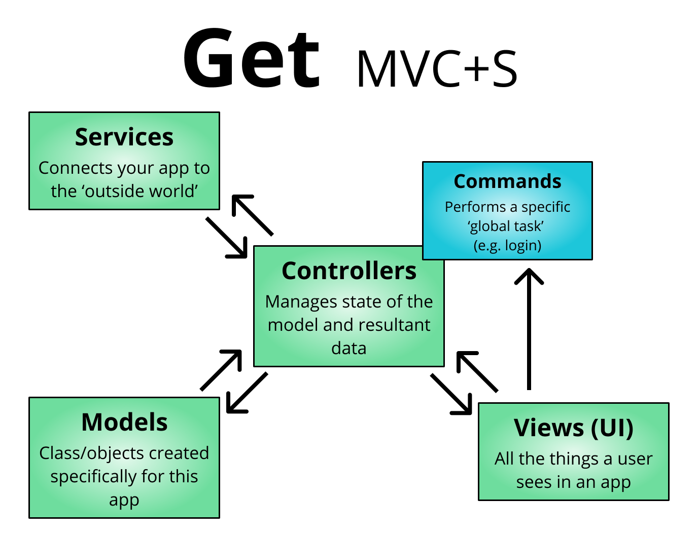

# Get Fluttered

A Flutter project linked to a [YouTube playlist]. Designed to teach various components used in Flutter health initiatives (e.g. within the [PRAPARE app]). When relevant, videos may also have a supplemental [blog post].

## Architecture

This app loosely follows the [Model-View-Controller+Services] `(MVC+S) architecture`, which has both [simple] and [production-level] examples of use. Whereas the above examples make heavy use of Provider, ChangeNotifier, and StatefulWidgets, we are instead using [Get] and some of the [Getx pattern] to simplify state management, routing, and dependency injection.

Our take on MVC+S is as follows:

- `model`: Class/objects created specifically for this app
- `views`: The UI layer, which is separated into multiple `pages` and may optionally be managed via a `viewcontroller`
- `controller`: Manages state of the model and resultant data. Controller classes typically extend `GetxController` (automatically disposed) and `GetxService` (rarely/never disposed)
- `service`: Connects your app with the outside world (e.g. internet or local file system).
- `command`: A high level function that performs a specific task, such as login/logout. It may utilize controllers, APIs, models, etc as necessary.

## Folder Structure

The following is the folder structure under the `/lib` folder:

| **Folder**   | **Subfolder**                          | **Description**                                                                                        |
| ------------ | -------------------------------------- | ------------------------------------------------------------------------------------------------------ |
| /_internal   |                                        | custom modifications, constants / enums, utility classes                                               |
|              | /components                            | custom components / variations on Flutter widgets                                                      |
|              | /constants                             | local constants created for the app                                                                    |
|              | /enums                                 | predefined, named constants                                                                            |
|              | /utils                                 | local functions that do things like formatting                                                         |
| /api         |                                        | optional API key location                                                                              |
|              | &lt;custom>.dart                       | private API keys                                                                                       |
|              | api_public.dart                        | public API keys (no gitignore)                                                                         |
|              | api.dart                               | generic export file                                                                                    |
| /controllers |                                        | manages state of the model and resultant data                                                          |
|              | /commands                              | performs a specific global task (login, logout, change password)                                       |
|              | ../&lt;custom>_command.dart            | custom command class                                                                                   |
|              | ../abstract_command.dart               | abstract class for commonly used controllers, placeholder execute() method for commands                |
|              | &lt;custom>_controller.dart            | custom controller, typically used for state management                                                 |
| /models      |                                        | classes / objects created specifically for this app                                                    |
|              | &lt;custom>_data.dart                  | custom data class                                                                                      |
|              | &lt;custom>_model.dart                 | data model that typically modifies or shapes a data class                                              |
| /routes      |                                        | maps route to screen widgets                                                                           |
|              | app_pages.dart                         | the directory of each page within an app                                                               |
|              | app_routes.dart                        | string route names used in the app                                                                     |
| /services    |                                        | interaction with the outside world (REST, FHIR, http, file storage)                                    |
| /ui          |                                        | essentially all things a user sees in the app                                                          |
|              | /styled_components                     | shared widgets that use a common design system / theme so that the app seems consistent across screens |
|              | ../styled_&lt;widget_name>.dart        |                                                                                                        |
|              | /views                                 | top level widgets that are loaded via a route                                                          |
|              | ../&lt;screen_name>/                   |                                                                                                        |
|              | ../../&lt;screen_name>.dart            | the screen widget, may optionally include 'page', 'card', or 'panel' at the end based on view type     |
|              | ../../&lt;screen_name>_binding.dart    | controllers/services that are loaded (or lazy-loaded) in a view                                        |
|              | ../../&lt;screen_name>_controller.dart | the viewcontroller that only affects this screen widget                                                |
|              | ../../&lt;screen_name>_test.dart       | any relevant tests for the screen widget or its viewcontroller                                         |
|              | icons.dart                             | icon asset locations                                                                                   |
|              | localization.dart                      | strings with multiple translations                                                                     |
|              | strings.dart                           | strings used throughout an app                                                                         |
|              | themes.dart                            | custom themes and font sizes                                                                           |
| main.dart    |                                        | the first file a Dart app runs                                                                         |

## Style Guide

Follow the [Dart style guide].

Of note, you should:

- Use `UpperCamelCase` for types.
- Use `lowercase_snake_case` for libraries, packages, directories, and files.
- Use `lowerCamelCase` for constant names.
- Use `lowerCamelCase` for everything else (like variable names).
- Capitalize acronyms and abbreviations longer than two letters (Http rather than HTTP or http).
- A leading underscore makes a member variable private. Only use it if it is private.
- You can use single line if statements for returns.
- Use `///` instead of `/** */` for multi-line comments.

For VS Code, install the Dart and Flutter plugin. Set your editor to [format on save].

## Questions

First, check the supplemental [blog post] and similar posts. That blog post also has an invite to the Flutter Juun Slack, which you are welcome to join. We're happy to answer questions in the Slack or on the relevant video in the GetFluttered [Youtube playlist].

[blog post]: https://mayjuun.com/blog/2-get-fluttered-mvcs
[Dart style guide]: https://dart.dev/guides/language/effective-dart/style
[format on save]: https://flutter.dev/docs/development/tools/formatting#automatically-formatting-code-in-vs-code
[Get]: https://pub.dev/packages/get#the-three-pillars
[Getx pattern]: https://github.com/kauemurakami/getx_pattern
[Model-View-Controller+Services]: https://blog.gskinner.com/archives/2020/09/flutter-state-management-with-mvcs.html
[PRAPARE app]: https://github.com/firejuun/prapare
[simple]: https://github.com/gskinnerTeam/flutter-mvcs-hello-world
[production-level]: https://github.com/gskinnerTeam/flokk
[Youtube playlist]: https://www.youtube.com/playlist?list=PL_e311Xg2aCQX98onj3OZ2XAE5vm8fCI1
